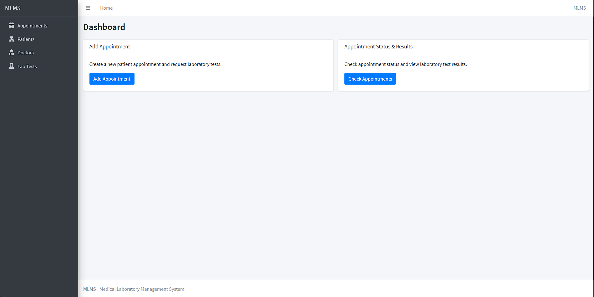
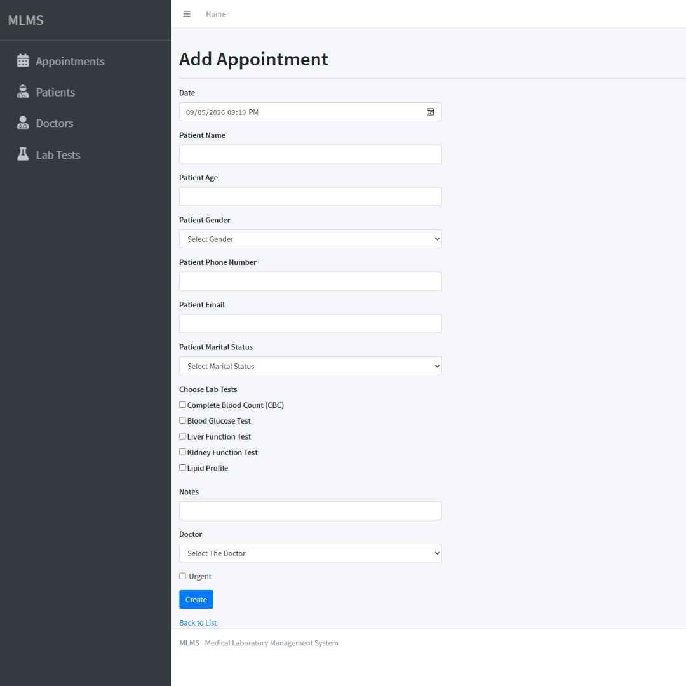
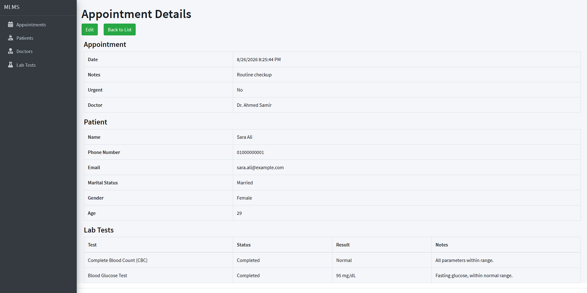
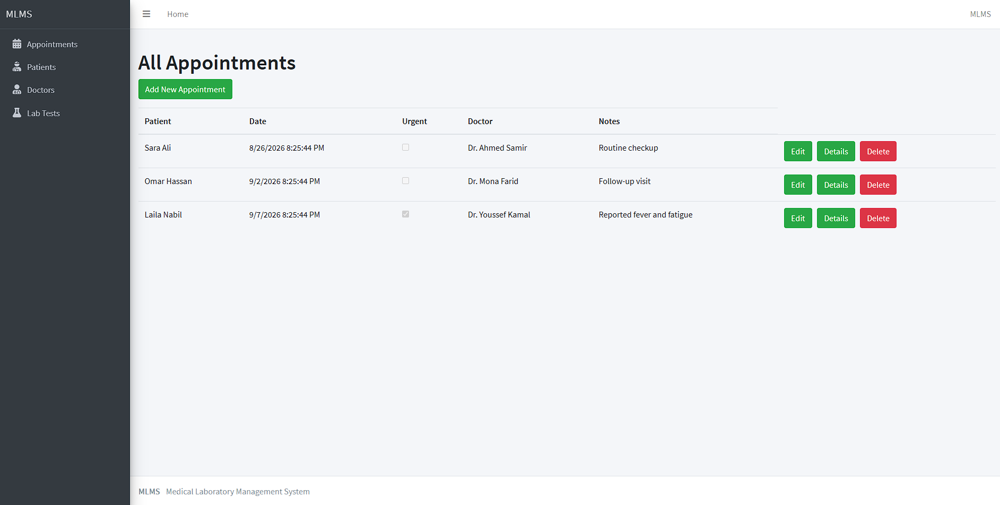

# Medical Laboratory Management System

A web application for managing patients, doctors, appointments, and lab test results at a medical laboratory - built as a hands-on project to apply ASP.NET Core MVC, Entity Framework Core, and SOLID design principles end to end.

## Screenshots


<!-- ### Dashboard -->


<!-- ### Scheduling an Appointment -->


<!-- ### Appointment Details & Lab Results -->


<!-- ### Patient / Doctor / Lab Test Management -->


## Features

- **Appointment management** - create, edit, and delete appointments, with automatic patient lookup/creation by phone number and lab test selection
- **Patient, Doctor, and Lab Test management** - CRUD operations where applicable, with referential-integrity checks preventing deletion of records still referenced elsewhere
- **Lab test result recording** - results move a requested test from `Queued` to `Completed`; this transition is enforced through domain methods, so an invalid state can't be created through the entity's public API
- **Deletion rules and referential integrity** - deleting an appointment removes its requested tests and associated results, and removes the patient record if that was their only appointment; doctors and lab tests cannot be deleted while still referenced by existing records

## Tech Stack

- **Backend:** ASP.NET Core MVC (.NET 8, C# 12)
- **Data access:** Entity Framework Core, Code-First, SQL Server
- **Frontend:** Razor Views, Bootstrap
- **Validation:** Data Annotations + server-side business-rule validation
- **Database configuration:** EF Core Fluent API
- **Version control:** Git / GitHub

## Architecture Notes

A few design decisions worth calling out for anyone reviewing the code:

- **Service layer:** business logic lives in per-entity services (e.g., `AppointmentServices`, `ResultServices`), built on a shared `GenericServices<T>` base for common CRUD, with entity-specific logic layered on top.
- **Encapsulated domain rules:** `RequestedLabTest` exposes `Create()` and `CompleteWithResult()` instead of public setters, so the relationship between test status and result stays under the entity's control rather than being enforced by convention alone.
- **Nullable reference types** are enabled and applied deliberately - `required` for genuinely mandatory fields, `null!` for EF navigation properties populated via foreign key rather than eager loading, and real `?` where a value is legitimately optional.
- **Querying:** list and detail views use targeted projections where appropriate, selecting only the fields the corresponding ViewModel needs rather than loading full entity graphs.

## Getting Started

1. Clone the repository:
   ```
   git clone <repository-url>
   cd <repository-folder>
   ```
2. Update the `MLMS` connection string in `appsettings.json` to point to your local SQL Server instance.
3. Apply the migrations:
   ```
   dotnet ef database update
   ```
4. (Optional) Seed sample data - doctors, lab tests, patients, and a few appointments in various states:
   - Open `Data/PopulateDB.cs` and follow the usage comment at the top: temporarily call `PopulateDB.Seed(context)` from `Program.cs`, between `var app = builder.Build();` and `app.Run();`.
   - Run the app once, then remove that block again - it's a one-time seed, not part of normal startup.
5. Run the application:
   ```
   dotnet run
   ```

## Project Status

**v1.0 - MVC version complete**

This project was built as a learning and portfolio project while studying ASP.NET Core MVC and Entity Framework Core in depth. This version represents the completed MVC stage.

The next stage is an ASP.NET Core Web API project, building on this domain to explore authentication, authorization, JWT, ASP.NET Core Identity, DTOs, asynchronous operations, and API design more broadly.

## Development Process

This project was developed iteratively, with features and fixes committed separately throughout - the Git history reflects the progression from initial domain and database design, through EF Core configuration and service-layer development, to business rules, validation, and UI implementation.
